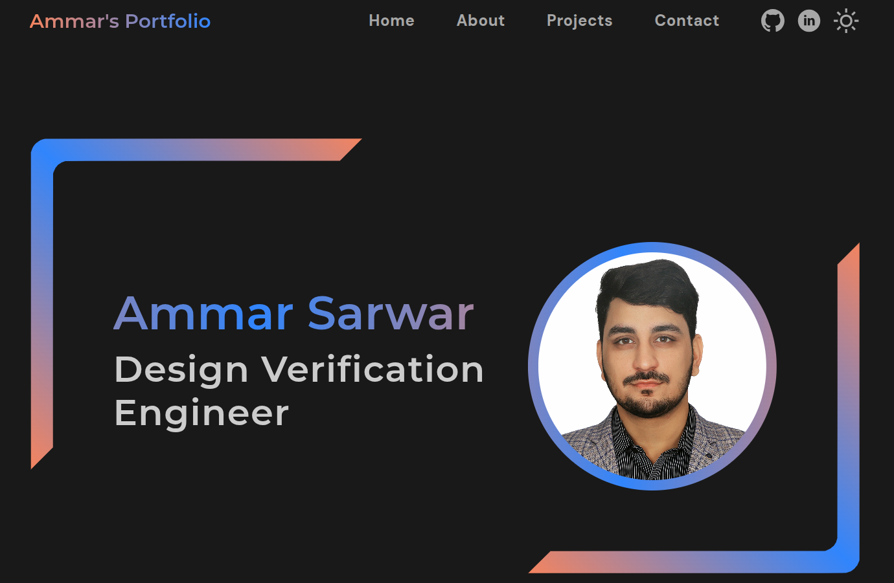

<base target="_blank">

# kevinchangjk

_Digital portfolio of Kevin Chang, a Software Developer_

## Background

This is a web application meant for providing a look into my software development skills.
The app itself is built with Next.js, with Chakra-UI as the front-end framework, and deployed on Vercel.

Do check out the website [here](https://www.kevinchangjk.com)!

## References & Inspiration

I built the entire application myself, starting with a bootstrapped Next.js project.
However, it is important to acknowledge that while I designed the bulk of the website, several snippets were inspired by the work of others, which I shall list below.

Before I began designing my own portfolio website, I spent hours going through several built by other web developers, taking reference from sites like [this](https://www.hostinger.com/tutorials/web-developer-portfolio).
In addition, I took inspiration from:

#### [Pavan MG](https://www.figma.com/community/file/1116246660507537002)

This is the original design template that I had considered using, and now, it still retains several aspects of this design.
The overall colour scheme is largely the same, and the main "Home" page and the "About" page are also retained.

#### [Adenekan Wonderful](https://www.codewonders.dev/)

This website has a clean introduction, with links to the rest of the website embedded in it.
The "Projects" page consisted of a grid of cards that displayed the thumbnails initially, and displayed a simple summary on hovering.

#### [Ian Dunkerley](https://dunks1980.com/)

Dunkerley's website is very minimalistic and simple, but what caught my eye was the framing pieces with the gradient backgrounds.
The pieces shift colour with user movement, and change stop colours with a click of the logo, which I thought was very interesting.

#### [Ram Maheshwari](https://www.rammaheshwari.com/)

I like the way Maheshwari showcases his projects, in a clean and straightforward manner, concise yet detailed enough.

#### [Patrick David](https://bepatrickdavid.com/)

David's website is bombastic, to say the least.
However, the part that I really liked was the design of his "Contact" page, which showcased his fields of interest as well.

## Running Locally

If you wish to run this project locally, to test it or to develop on it, feel free to fork or clone this repository.
Note that this is a [Next.js](https://nextjs.org/) project bootstrapped with [`create-next-app`](https://github.com/vercel/next.js/tree/canary/packages/create-next-app), and built with [Chakra-UI](https://chakra-ui.com/).

### Getting Started

First, install packages with `yarn`. Then, run the development server with `yarn dev`.

Open [http://localhost:3000](http://localhost:3000) with your browser to see the result.

### Deployment

I have deployed this website on [Vercel](https://vercel.com), which is the simplest to use for Next.js projects.
